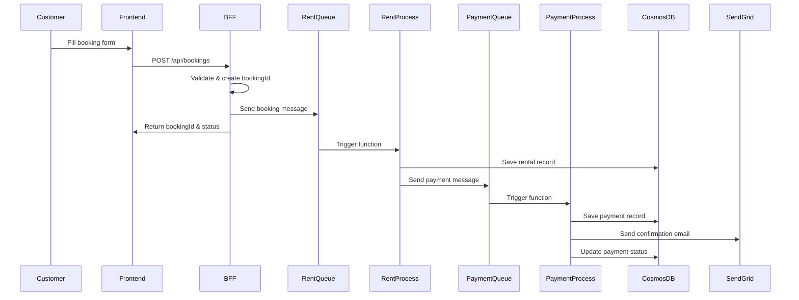
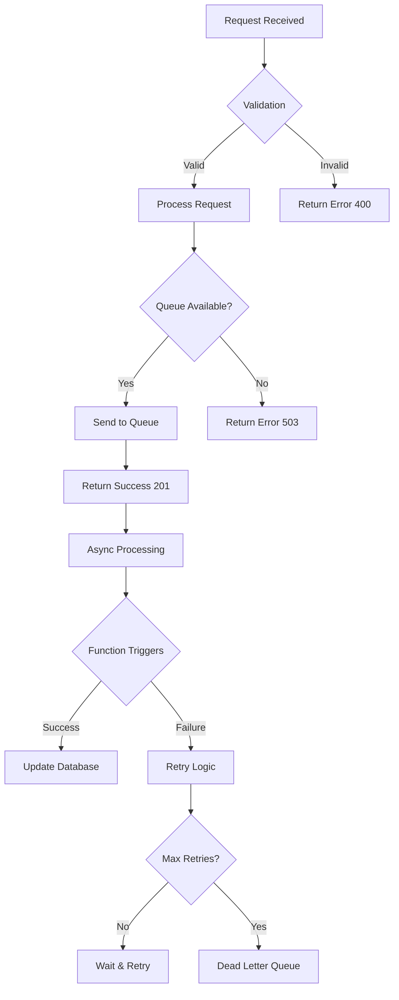
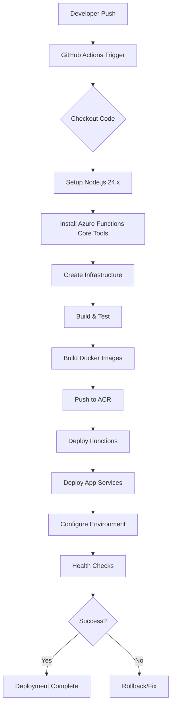
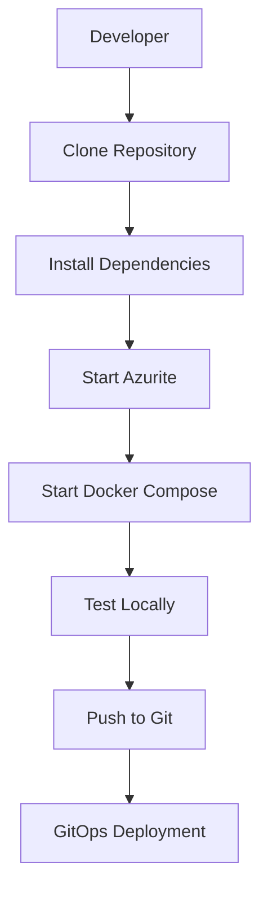

# Cloud-Native Car Rental Application Architecture

## Overview

This document provides a comprehensive technical overview of the Cloud-Native Car Rental Application, a production-ready system built on Microsoft Azure using modern cloud-native patterns and DevOps practices.

## Table of Contents

- [System Architecture](#system-architecture)
- [Component Architecture](#component-architecture)
- [Data Flow Architecture](#data-flow-architecture)
- [Technology Stack](#technology-stack)
- [Infrastructure Architecture](#infrastructure-architecture)
- [Deployment Architecture](#deployment-architecture)
- [Security Architecture](#security-architecture)
- [Monitoring & Observability](#monitoring--observability)
- [Scalability & Performance](#scalability--performance)

## System Architecture

### High-Level Architecture

```
┌─────────────────────────────────────────────────────────────────┐
│                    Cloud-Native Car Rental System                │
│                                                                 │
│  ┌─────────────────┐    ┌─────────────────┐    ┌─────────────┐   │
│  │   Customer      │    │   Frontend      │    │  BFF Service │   │
│  │   Browser       │◄──►│  (Static Web)  │◄──►│  (API Gateway)│   │
│  └─────────────────┘    └─────────────────┘    └─────────────┘   │
│                                                                 │
│  ┌─────────────────────────────────────────────────────────────┐ │
│  │                Event-Driven Processing Layer                │ │
│  │                                                             │ │
│  │  ┌─────────────┐    ┌─────────────┐    ┌─────────────┐       │ │
│  │  │ rent-queue  │    │RentProcess │    │payment-queue│       │ │
│  │  │ (Azure      │───►│ Function   │───►│ (Azure      │       │ │
│  │  │  Storage)   │    │ (Serverless)│    │  Storage)   │       │ │
│  │  └─────────────┘    └─────────────┘    └─────────────┘       │ │
│  │                                                             │ │
│  │                           │                                 │ │
│  │                           ▼                                 │ │
│  │                  ┌─────────────┐                            │ │
│  │                  │PaymentProcess│                            │ │
│  │                  │ Function     │                            │ │
│  │                  │ (Serverless) │                            │ │
│  │                  └─────────────┘                            │ │
│  └─────────────────────────────────────────────────────────────┘ │
│                                                                 │
│  ┌─────────────────────────────────────────────────────────────┐ │
│  │                 Data & External Services                    │ │
│  │                                                             │ │
│  │  ┌─────────────┐    ┌─────────────┐    ┌─────────────┐       │ │
│  │  │  Cosmos DB  │    │   SendGrid  │    │ Application │       │ │
│  │  │  (NoSQL DB) │    │   (Email)   │    │  Insights   │       │ │
│  │  └─────────────┘    └─────────────┘    └─────────────┘       │ │
│  └─────────────────────────────────────────────────────────────┘ │
└─────────────────────────────────────────────────────────────────┘
```

### Architecture Principles

- **Microservices**: Decoupled, independently deployable services
- **Event-Driven**: Asynchronous communication via message queues
- **Serverless**: Azure Functions for compute with auto-scaling
- **Containerized**: Docker containers for consistent deployment
- **GitOps**: Infrastructure and application managed via Git

## Component Architecture

### 1. Frontend Service

**Technology**: HTML5, CSS3, Vanilla JavaScript
**Deployment**: Azure App Service (Linux) with Nginx container
**Responsibilities**:
- User interface for car rental booking
- Form validation and user experience
- API communication with BFF Service
- Responsive design for mobile/desktop

**Key Features**:
- Dynamic API URL detection (localhost vs production)
- Real-time form validation
- Error handling and user feedback
- Progressive enhancement

### 2. Backend for Frontend (BFF) Service

**Technology**: Node.js 24.x, Express.js
**Deployment**: Azure App Service (Linux) with custom container
**Responsibilities**:
- API gateway for frontend requests
- Request validation and sanitization
- Message queuing to Azure Storage Queues
- Error handling and logging

**API Endpoints**:
```
POST /api/bookings    - Create new booking
GET  /api/bookings/:id - Get booking status
POST /api/payments    - Process payment
GET  /api/health      - Health check endpoint
```

### 3. Azure Functions (Serverless Processing)

#### RentProcess Function
**Trigger**: Azure Storage Queue (`rent-queue`)
**Runtime**: Node.js 24.x
**Bindings**:
- Input: QueueTrigger (rent-queue)
- Output: Queue (payment-queue)
- Output: CosmosDB (Rentals container)

**Responsibilities**:
- Process rental booking requests
- Validate booking data
- Store booking in Cosmos DB
- Queue payment processing message

#### PaymentProcess Function
**Trigger**: Azure Storage Queue (`payment-queue`)
**Runtime**: Node.js 24.x
**Bindings**:
- Input: QueueTrigger (payment-queue)
- Output: CosmosDB (Payments container)
- Output: SendGrid (email notifications)

**Responsibilities**:
- Process payment transactions
- Update payment status in database
- Send confirmation emails via SendGrid
- Handle payment failures gracefully

### 4. Data Storage Layer

#### Azure Cosmos DB
**Configuration**:
- Database: `RentACarDB`
- Containers:
  - `Rentals` (partition key: `/bookingId`)
  - `Payments` (partition key: `/paymentId`)

**Data Models**:

**Rental Document**:
```json
{
  "bookingId": "uuid",
  "customerName": "string",
  "email": "string",
  "phone": "string",
  "carType": "string",
  "rentalDays": "number",
  "totalAmount": "number",
  "pickupDate": "string",
  "returnDate": "string",
  "pickupLocation": "string",
  "bookingDate": "string",
  "status": "pending|confirmed|cancelled"
}
```

**Payment Document**:
```json
{
  "paymentId": "uuid",
  "bookingId": "uuid",
  "amount": "number",
  "currency": "USD",
  "status": "pending|completed|failed",
  "paymentDate": "string",
  "email": "string"
}
```

#### Azure Storage Queues
**Queues**:
- `rent-queue`: Booking processing messages
- `payment-queue`: Payment processing messages

**Message Format**:
```json
{
  "id": "uuid",
  "data": { /* booking or payment data */ },
  "timestamp": "ISO string",
  "source": "bff-service"
}
```

## Data Flow Architecture

### Complete Booking Flow



### Error Handling Flow



## Technology Stack

### Core Technologies

| Component | Technology | Version | Purpose |
|-----------|------------|---------|---------|
| **Frontend** | HTML5, CSS3, JavaScript | ES6+ | User Interface |
| **Backend** | Node.js, Express.js | 24.x | API Services |
| **Functions** | Azure Functions | v4 | Serverless Compute |
| **Database** | Azure Cosmos DB | - | NoSQL Data Storage |
| **Queues** | Azure Storage Queues | - | Message Queuing |
| **Email** | SendGrid | - | Email Notifications |
| **Containers** | Docker | - | Application Packaging |
| **CI/CD** | GitHub Actions | - | Automated Deployment |

### Development Tools

| Tool | Purpose |
|------|---------|
| **Azure Functions Core Tools** | Local function development |
| **Azurite** | Local Azure Storage emulator |
| **Docker Compose** | Local multi-container development |
| **Azure CLI** | Infrastructure management |
| **Git** | Version control |
| **VS Code** | Development environment |

### Azure Services

| Service | Tier/SKU | Purpose |
|---------|----------|---------|
| **App Service** | S1 (Shared) | Web application hosting |
| **Azure Functions** | Consumption | Serverless compute |
| **Cosmos DB** | - | Global NoSQL database |
| **Storage Account** | Standard_LRS | Queues and file storage |
| **Container Registry** | Basic | Docker image registry |

## Infrastructure Architecture

### Azure Resource Organization

```
┌─────────────────────────────────────────────────────────────┐
│                    Azure Subscription                        │
│  ┌─────────────────────────────────────────────────────────┐  │
│  │                Resource Group                           │  │
│  │            (rentacar-app-rg)                           │  │
│  │                                                         │  │
│  │  ┌─────────────┐  ┌─────────────┐  ┌─────────────┐      │  │
│  │  │ App Service │  │ App Service │  │  Function  │      │  │
│  │  │ (Frontend)  │  │   (BFF)     │  │    App      │      │  │
│  │  │             │  │             │  │             │      │  │
│  │  └─────────────┘  └─────────────┘  └─────────────┘      │  │
│  │                                                         │  │
│  │  ┌─────────────┐  ┌─────────────┐  ┌─────────────┐      │  │
│  │  │  Cosmos DB  │  │   Storage   │  │    ACR      │      │  │
│  │  │             │  │  Account    │  │             │      │  │
│  │  └─────────────┘  └─────────────┘  └─────────────┘      │  │
│  └─────────────────────────────────────────────────────────┘  │
└─────────────────────────────────────────────────────────────┘
```

### Network Architecture

```
┌─────────────────────────────────────────────────────────────┐
│                 Network Security Groups                     │
│  ┌─────────────────────────────────────────────────────────┐  │
│  │                Azure App Services                       │  │
│  │  ┌─────────────┐  ┌─────────────┐  ┌─────────────┐      │  │
│  │  │   Frontend  │  │     BFF     │  │  Functions  │      │  │
│  │  │  (Port 80)  │  │  (Port 3000)│  │             │      │  │
│  │  └─────────────┘  └─────────────┘  └─────────────┘      │  │
│  │                                                         │  │
│  │  Private Endpoints:                                     │  │
│  │  • Cosmos DB                                            │  │
│  │  • Storage Account                                      │  │
│  │  • Container Registry                                   │  │
│  └─────────────────────────────────────────────────────────┘  │
│                                                             │  │
│  Public Internet Access:                                    │  │
│  • Frontend App Service (HTTPS only)                        │  │
│  • BFF App Service (HTTPS only)                             │  │
└─────────────────────────────────────────────────────────────┘
```

## Deployment Architecture

### GitOps Pipeline



### CI/CD Stages

1. **Infrastructure Creation**
   - Resource Group
   - Storage Account & Queues
   - Cosmos DB & Containers
   - Function App & App Services
   - Container Registry

2. **Build & Test**
   - Install dependencies
   - Run unit tests
   - Build Docker images
   - Security scanning

3. **Deployment**
   - Deploy Azure Functions
   - Deploy containerized apps
   - Configure environment variables
   - Set up CORS policies

4. **Validation**
   - Health checks
   - Integration tests
   - Performance validation

## Security Architecture

### Authentication & Authorization

```
┌─────────────────────────────────────────────────────────────┐
│                 Security Layers                             │
│  ┌─────────────────────────────────────────────────────────┐  │
│  │  1. Network Security                                    │  │
│  │     • HTTPS Only (Azure Front Door/App Service)         │  │
│  │     • IP Restrictions                                    │  │
│  │     • Network Security Groups                            │  │
│  │                                                         │  │
│  │  2. Application Security                                │  │
│  │     • Input Validation & Sanitization                    │  │
│  │     • CORS Configuration                                 │  │
│  │     • Rate Limiting                                      │  │
│  │                                                         │  │
│  │  3. Data Security                                       │  │
│  │     • Encryption at Rest (Cosmos DB)                    │  │
│  │     • Encryption in Transit (TLS 1.3)                   │  │
│  │     • Secure Connection Strings                          │  │
│  │                                                         │  │
│  │  4. Access Control                                      │  │
│  │     • Azure RBAC for Resource Access                    │  │
│  │     • Managed Identity for Service Access               │  │
│  │     • Least Privilege Principle                          │  │
│  └─────────────────────────────────────────────────────────┘  │
└─────────────────────────────────────────────────────────────┘
```

### Secrets Management

- **GitHub Secrets**: `AZURE_CREDENTIALS`, `AZURE_STORAGE_CONNECTION_STRING`, `COSMOS_DB_CONNECTION_STRING`
- **Azure Key Vault**: For production secrets (future enhancement)
- **Managed Identity**: For service-to-service authentication

## Monitoring & Observability

### Application Insights Integration

```
┌─────────────────────────────────────────────────────────────┐
│              Monitoring & Observability                     │
│  ┌─────────────────────────────────────────────────────────┐  │
│  │  Application Insights                                   │  │
│  │  ┌─────────────┐  ┌─────────────┐  ┌─────────────┐      │  │
│  │  │   Requests  │  │  Performance │  │   Errors    │      │  │
│  │  │             │  │             │  │             │      │  │
│  │  └─────────────┘  └─────────────┘  └─────────────┘      │  │
│  │                                                         │  │
│  │  Azure Monitor                                          │  │
│  │  ┌─────────────┐  ┌─────────────┐  ┌─────────────┐      │  │
│  │  │   Metrics   │  │    Logs     │  │   Alerts    │      │  │
│  │  │             │  │             │  │             │      │  │
│  │  └─────────────┘  └─────────────┘  └─────────────┘      │  │
│  └─────────────────────────────────────────────────────────┘  │
└─────────────────────────────────────────────────────────────┘
```

### Key Metrics Monitored

- **Application Performance**: Response times, throughput, error rates
- **Infrastructure**: CPU, memory, disk usage
- **Business Metrics**: Booking completions, payment success rates
- **Queue Health**: Message counts, processing times, dead letters

## Scalability & Performance

### Auto-Scaling Configuration

**Azure Functions (Consumption Plan)**:
- Scales automatically based on queue message load
- No minimum instances (pay-per-execution)
- Maximum burst scaling

**App Services**:
- Manual scaling (S1 tier)
- Can be upgraded to Premium for auto-scaling
- Container-based deployment allows horizontal scaling

### Performance Optimizations

1. **Database Partitioning**: Proper partition keys for efficient queries
2. **Queue-Based Processing**: Decouples services, prevents cascading failures
3. **Caching**: Azure CDN for static assets (future enhancement)
4. **Connection Pooling**: Efficient database connections

### Capacity Planning

| Component | Current Load | Scaling Strategy |
|-----------|--------------|------------------|
| **Frontend** | Static content | CDN + App Service auto-scaling |
| **BFF Service** | API requests | App Service scaling + load balancer |
| **Functions** | Queue messages | Consumption plan auto-scaling |
| **Cosmos DB** | Read/write operations | Automatic partitioning |
| **Queues** | Message throughput | Automatic scaling |

## API Architecture

### REST API Design

**BFF Service Endpoints**:

```
┌─────────────────────────────────────────────────────────────┐
│                    API Architecture                         │
│  ┌─────────────────────────────────────────────────────────┐  │
│  │  POST /api/bookings                                     │  │
│  │  • Create new rental booking                            │  │
│  │  • Input: booking details                               │  │
│  │  • Output: bookingId, status                            │  │
│  │                                                         │  │
│  │  GET /api/bookings/:id                                  │  │
│  │  • Get booking status                                   │  │
│  │  • Input: bookingId                                     │  │
│  │  • Output: booking details                              │  │
│  │                                                         │  │
│  │  POST /api/payments                                     │  │
│  │  • Process payment                                      │  │
│  │  • Input: payment details                               │  │
│  │  • Output: paymentId, status                            │  │
│  │                                                         │  │
│  │  GET /api/health                                        │  │
│  │  • Health check endpoint                                │  │
│  │  • Output: service status                               │  │
│  └─────────────────────────────────────────────────────────┘  │
└─────────────────────────────────────────────────────────────┘
```

### Error Handling

**HTTP Status Codes**:
- `200 OK`: Successful operation
- `201 Created`: Resource created successfully
- `400 Bad Request`: Invalid input data
- `404 Not Found`: Resource not found
- `500 Internal Server Error`: Server error

**Error Response Format**:
```json
{
  "success": false,
  "message": "Error description",
  "errorCode": "ERROR_CODE",
  "timestamp": "ISO_DATE_STRING"
}
```

## Development Workflow

### Local Development Setup



### Branching Strategy

- **main**: Production branch (protected)
- **staging**: Test environment (optional)
- **feature/***: Feature branches

### Code Quality

- **Linting**: ESLint for JavaScript
- **Testing**: Unit tests for functions and services
- **Security**: Dependency scanning
- **Documentation**: Auto-generated API docs

## Disaster Recovery

### Backup Strategy

- **Cosmos DB**: Automatic backups, point-in-time restore
- **Storage Queues**: Geo-redundant storage
- **Application Code**: Git repository as source of truth

### High Availability

- **Multi-region**: Azure services with geo-redundancy
- **Load Balancing**: Built-in Azure load balancing
- **Circuit Breakers**: Queue-based resilience

## Future Enhancements

### Phase 2 Features
- **User Authentication**: Azure AD B2C integration
- **Real Payments**: Stripe/PayPal integration
- **Admin Dashboard**: Booking management interface
- **Mobile App**: React Native companion app

### Technical Improvements
- **API Gateway**: Azure API Management
- **Caching**: Azure Redis Cache
- **CDN**: Azure Front Door
- **Monitoring**: Advanced Application Insights

---

**This architecture document provides a complete technical overview of the Cloud-Native Car Rental Application. The system demonstrates modern cloud-native patterns, event-driven architecture, and DevOps best practices suitable for production deployment.**

For implementation details, see the [README.md](README.md) and [BLOG.md](BLOG.md) files.</content>
<parameter name="filePath">e:\Cloud-Native Car Rental Application\ARCHITECTURE.md